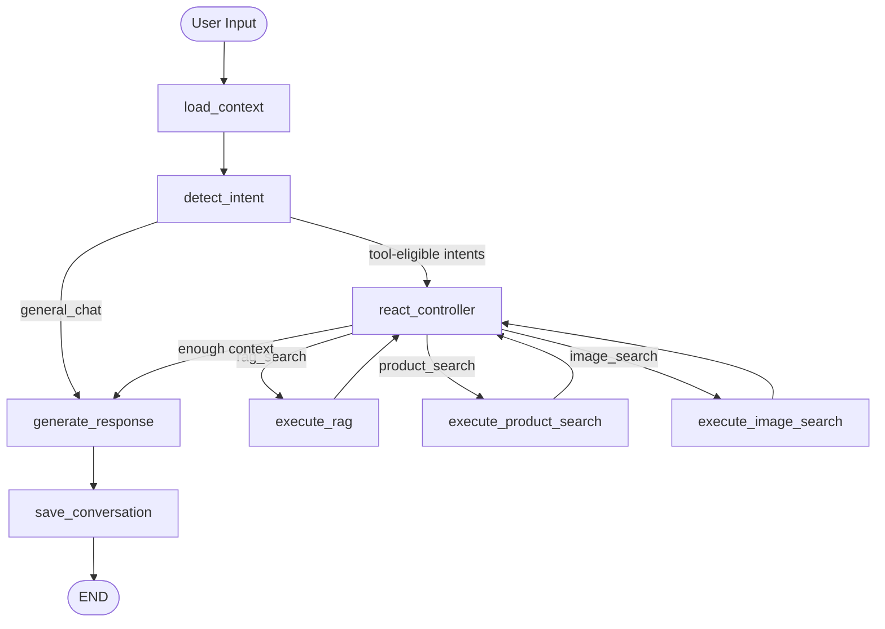

# AI Shopping Assistant

> **Portfolio / interview-scope project** — a clean, runnable, well-architected AI backend demonstrating RAG, LangGraph agent orchestration, typed APIs, multilingual Persian/English support, and Dockerised local development.

---

## Purpose & Scope

This project is **not** a production Digikala clone. It is a reference implementation that shows:

- LangGraph-based agent with explicit nodes and conditional routing
- RAG pipeline (Qdrant + OpenRouter embeddings)
- Playwright-backed public product search (with mock fallback)
- Multilingual support (Persian + English, auto-detected)
- Pydantic v2 typed API with discriminated widget payloads
- Clean modular monolith with dependency injection

---

## Architecture Overview

```
FastAPI Routers
  └── ShoppingAgent
        └── LangGraph (compiled StateGraph)
              ├── load_context           (conversation repo)
              ├── detect_intent          (LLM or keyword fallback)
              ├── route_by_intent        (conditional edge)
              ├── react_controller       (bounded ReAct loop — tool selection)
              ├── execute_rag            (Qdrant retrieval)
              ├── execute_product_search (provider)
              ├── execute_image_search   (vision LLM + search)
              ├── generate_response      (LLM synthesis)
              └── save_conversation      (in-memory repo)

Infrastructure
  ├── OpenRouter  — chat, vision, embeddings
  ├── Qdrant      — vector store
  └── Playwright  — public Digikala search
```

---

## LangGraph Flow



---

## Directory Layout

```
backend/
  app/
    main.py                    # FastAPI app, lifespan, exception handlers
    api/
      dependencies.py          # DI container (singleton factories)
      routers/                 # chat, documents, history, health
    agents/shopping_agent.py   # ShoppingAgent wraps compiled graph
    graph/
      builder.py               # build_shopping_graph()
      state.py                 # AgentState TypedDict
      nodes/                   # one file per node
    tools/                     # rag_search, product_search, image_understanding, memory
    rag/                       # chunking, loader, indexing, retrieval
    vectorstore/               # qdrant client + collection bootstrap
    services/                  # llm, embedding, intent, product, recommendation, image
    repositories/              # ConversationRepository + InMemory impl
    providers/                 # ProductProvider protocol + Mock + Digikala
    prompts/                   # intent, response, image, recommendation templates
    models/domain.py           # all domain Pydantic models
    schemas/                   # API/tool/widget schemas
    core/                      # config, logging, exceptions
    utils/                     # ids, files, language helpers
  scripts/
    index_documents.py         # index seed docs into Qdrant
    seed_demo_documents.py     # verify seed file presence
  tests/                       # pytest suite (no real API keys needed)
data/
  documents/                   # seed Markdown files (Persian + English)
  uploads/                     # runtime upload target
```

---

## Environment Setup

```bash
cp .env.example .env
# Edit .env and set at minimum:
# OPENROUTER_API_KEY=sk-or-...
# OPENROUTER_CHAT_MODEL=google/gemini-2.5-flash-lite
# OPENROUTER_VISION_MODEL=google/gemini-2.5-flash-lite
# OPENROUTER_EMBEDDING_MODEL=openai/text-embedding-3-small
# PRODUCT_PROVIDER=mock    # use 'digikala' for real scraping
```

---

## Local Execution (without Docker)

```bash
python -m venv .venv && source .venv/bin/activate
pip install -r requirements.txt
playwright install chromium

# Start Qdrant separately (or skip — app runs with qdrant unreachable)
docker run -p 6333:6333 qdrant/qdrant:v1.12.4

# Start API
PYTHONPATH=. uvicorn backend.app.main:app --reload --port 8000
```

---

## Docker Execution

```bash
cp .env.example .env   # fill in OPENROUTER_API_KEY
docker compose up --build
```

The API is available at `http://localhost:8000`.
Qdrant dashboard: `http://localhost:6333/dashboard`

---

## Document Indexing

```bash
# After docker compose up --build
docker compose exec api python -m backend.scripts.index_documents

# Or locally
PYTHONPATH=. python -m backend.scripts.index_documents
```

---

## API Examples

### Health check

```bash
curl http://localhost:8000/health
```

### Persian product search

```bash
curl -X POST http://localhost:8000/chat \
  -H 'Content-Type: application/json' \
  -d '{
    "message": "یک کیبورد گیمینگ زیر ۳ میلیون تومان می‌خوام",
    "metadata": {"currency": "IRR", "locale": "fa-IR"}
  }'
```

### English recommendation

```bash
curl -X POST http://localhost:8000/chat \
  -H 'Content-Type: application/json' \
  -d '{"message": "recommend a good headphone under 5 million toman"}'
```

### RAG query (requires indexed docs)

```bash
curl -X POST http://localhost:8000/chat \
  -H 'Content-Type: application/json' \
  -d '{"message": "سیاست بازگشت کالا چیست؟"}'
```

### Upload document

```bash
curl -X POST http://localhost:8000/documents/upload \
  -F 'file=@data/documents/sample_headphones.md'
```

### Index a document

```bash
curl -X POST http://localhost:8000/documents/index \
  -H 'Content-Type: application/json' \
  -d '{"file_path": "sample_headphones.md"}'
```

### Image search

```bash
curl -X POST http://localhost:8000/chat/image \
  -F 'image=@/path/to/keyboard.jpg' \
  -F 'message=دنبال چیزی شبیه این هستم'
```

### Conversation history

```bash
curl 'http://localhost:8000/history?conversation_id=<your-id>'
```

---

## Example Response with Persian Widgets

```json
{
  "conversation_id": "f3a1...",
  "message_id": "9bc2...",
  "answer": "سه گزینه مناسب برای شما پیدا کردم:",
  "intent": "recommendation",
  "products": [],
  "widgets": [
    {
      "type": "comparison_table",
      "data": {
        "title": "محصولات پیشنهادی",
        "columns": ["محصول", "قیمت", "امتیاز"],
        "rows": [
          ["کیبورد گیمینگ مکانیکی ردراگون K552", "۲٬۸۵۰٬۰۰۰ تومان", "4.5"],
          ["کیبورد گیمینگ گرین GK601-RGB", "۱٬۹۵۰٬۰۰۰ تومان", "4.2"]
        ]
      }
    }
  ],
  "sources": [],
  "debug": {
    "used_rag": false,
    "used_product_search": true,
    "used_image_analysis": false,
    "intent_confidence": 0.84,
    "detected_language": "fa"
  }
}
```

---

## Running Tests

```bash
# No API keys, no Qdrant, no Playwright needed
PYTHONPATH=. pytest backend/tests/ -v
```

Test coverage:

| File | What it tests |
|---|---|
| `test_health.py` | `/health` endpoint fields |
| `test_intent_routing.py` | Fallback intent classification (fa + en) |
| `test_widgets.py` | Widget serialization + discriminated union |
| `test_product_provider.py` | Mock provider correctness |
| `test_language_utils.py` | Numeral normalisation, price parsing, language detection |

---

## Limitations

1. **Digikala Playwright provider** — targets public search pages only. Selectors may break if Digikala updates its markup. Always run with `PRODUCT_PROVIDER=mock` for demos and tests.
2. **No real-time pricing** — mock prices are static; even Playwright prices may be stale.
3. **In-memory conversation store** — resets on restart. Swap `InMemoryConversationRepository` for a PostgreSQL implementation behind the same interface for persistence.
4. **OpenRouter rate limits** — embedding and chat calls share the same API key quota.
5. **Single-process only** — the in-memory store is not shared across multiple API workers.

---

## Responsible Scraping Note

The `DigikalaPlaywrightProvider` only accesses Digikala's **public search pages** via a standard browser automation session. It does not bypass authentication, CAPTCHAs, rate limits, or any anti-bot controls. For production use, consult Digikala's Terms of Service and use their official API or affiliate programme if available.

---

## Suggested Next Improvements

- Replace in-memory repo with async PostgreSQL via `asyncpg` or SQLAlchemy 2.0
- Add Redis for shared conversation cache across workers
- Stream LLM responses via Server-Sent Events
- Add OpenTelemetry tracing to the LangGraph nodes
- Persist Qdrant product catalog separately from the document collection
- Add a Celery worker for async document indexing jobs
- Write integration tests against a Qdrant test container
- Support additional product sources (Amazon, Torob) via the `ProductProvider` protocol
